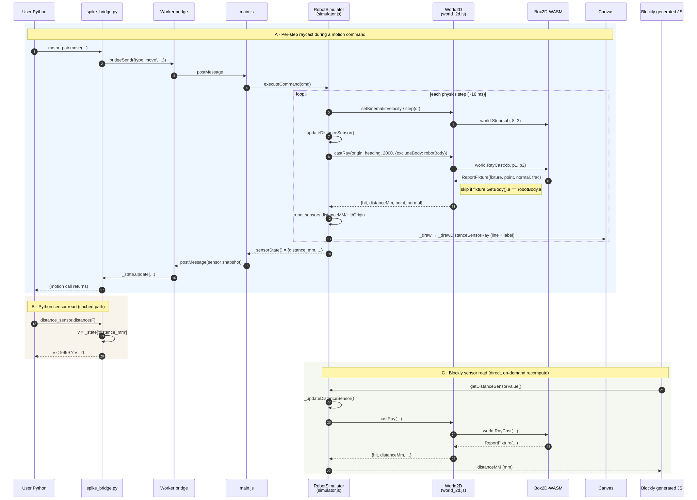

# Distance sensor — proper raycasting

**Status:** approved design, ready to plan
**Author:** brainstorm session 2026-05-09
**Branch:** `feature/distance-sensor-raycast`

## Problem

`robot.sensors.distanceMM` is initialized to `300` and never recomputed. The Hub
panel reads `30.0 cm` constantly; `distance_sensor.distance(F)` from MicroPython
returns the same frozen value regardless of robot position or obstacles. Now
that Box2D-WASM owns the world (`js/world_2d.js`), we have a real physics
engine that can answer "what's in front of the robot" via raycasting.

## Goals

- `distance_sensor.distance(F)` returns mm to the nearest field obstacle along
  the heading direction, accurate within ~5 mm (the Box2D `b2_linearSlop`
  tolerance).
- Out-of-range (≥ 2000 mm or no hit) returns `-1` to user code, matching the
  existing Python bridge contract.
- A subtle on-canvas overlay shows the ray and a numeric distance label (mm,
  matching the ruler ticks) during animation, so students can see what their
  sensor reads without inspecting the Hub panel.
- Mechanism is reusable: future sensors (color lookahead, line-follow assist)
  can call the same primitive.

## Non-goals

- Multi-ray cone / beam-width modeling. Single-ray model only; LEGO's real
  sensor has a small cone but FLL teams code as if it's a single beam.
- A user-facing toggle for the overlay. Always-on during animation; persistence
  plumbing can come later if anyone asks.
- Surface-friendly heuristics (e.g. ignoring transparent zones, filtering
  short-range noise). The raw raycast distance is the answer.
- Any change to `py/spike_bridge.py`. The wire format `distance_mm ≥ 9999 → -1`
  already exists at `py/spike_bridge.py:308`; we honor it from the sim side.

## Architecture

```
js/world_2d.js       ← new: World2D.castRay(origin, dir, maxDist, opts)
js/simulator.js      ← new: _distanceSensorMount, _updateDistanceSensor,
                       _drawDistanceSensorRay; two new constants
py/spike_bridge.py   ← unchanged
```

Boundary: `simulator.js` continues to know nothing about `b2*` types. The new
`World2D.castRay` takes mm-space inputs and returns mm-space outputs only.
Future sensors reuse it without learning Box2D.

### Coordinate frame

The internal frame is **math y-up** (origin bottom-left, +y north, headings
math: `0=east, 90=north, 180=west, 270=south`, CCW positive). Box2D operates
in this same frame — `_animateTank` writes `pose.y` straight into `robot.y`
without flipping. `_distanceSensorMount` and `_updateDistanceSensor` produce
math-y values; only `_drawDistanceSensorRay` converts to canvas y-down at the
rendering boundary (`canvasY = FIELD_H_MM - mathY`), matching the existing
`_drawField`, `_drawTrail`, etc.

Robot defaults: spawn `(350, 163)`, heading `90°` (north).

### Component interactions



Source: [`2026-05-09-distance-sensor-raycast-interactions.mmd`](2026-05-09-distance-sensor-raycast-interactions.mmd)

Three flows worth understanding before reading the rest of the spec:

- **A · Per-step raycast (blue).** During a motion command, every physics
  tick the sim asks `World2D.castRay`, which runs `world.RayCast` and clamps
  to the closest non-robot fixture. The result populates
  `robot.sensors.distanceMM` (for the post-command snapshot) and
  `distanceHit`/`distanceOrigin` (for the canvas overlay).
- **B · Python sensor read (sand).** Python reads `_state['distance_mm']`
  directly — no JS round-trip. The cached value is whatever the last command-
  end snapshot stored. A read from Python while the robot is idle returns
  whatever the last command wrote. This is a pre-existing architectural
  property of the bridge, not something this work changes.
- **C · Blockly sensor read (green).** Blockly's generators call
  `window.sim.getDistanceSensorValue()` directly from generated JS (no worker
  round-trip), so an on-demand recompute in the getter gives Blockly programs
  a fresh value any read. Python does **not** traverse this path.

## `World2D.castRay`

### Signature

```js
castRay(originMm, directionRad, maxDistMm, { excludeBody = null } = {})
  → { hit: boolean, distanceMm: number, point: {x, y} | null, normal: {x, y} | null }
```

- `hit = false` ⇒ `distanceMm = maxDistMm`, `point = null`, `normal = null`.
- `hit = true`  ⇒ `distanceMm` is the distance in mm to the closest fixture
  along the ray (excluding `excludeBody`'s fixtures); `point` is in field-mm
  coordinates; `normal` is the surface normal at the hit (unit, dimensionless).

### Implementation

```js
castRay(originMm, directionRad, maxDistMm, { excludeBody = null } = {}) {
  const ox = originMm.x * M_PER_MM;
  const oy = originMm.y * M_PER_MM;
  const dx = Math.cos(directionRad);
  const dy = Math.sin(directionRad);
  const maxM = maxDistMm * M_PER_MM;

  const p1 = new box2d.b2Vec2(ox, oy);
  const p2 = new box2d.b2Vec2(ox + dx * maxM, oy + dy * maxM);

  let bestPoint = null;
  let bestNormal = null;
  let bestFrac = 1.0;

  const excludePtr = excludeBody ? box2d.getPointer(excludeBody) : 0;

  // box2d-wasm RayCastCallback recipe for "find the closest fixture": return
  // the fraction to clamp the search to that fraction. Return -1 to ignore
  // and keep the previous clamp (used to skip the robot itself).
  const cb = new box2d.JSRayCastCallback();
  cb.ReportFixture = (fixturePtr, pointPtr, normalPtr, fraction) => {
    const fixture = box2d.wrapPointer(fixturePtr, box2d.b2Fixture);
    if (excludePtr && box2d.getPointer(fixture.GetBody()) === excludePtr) return -1;

    const point  = box2d.wrapPointer(pointPtr,  box2d.b2Vec2);
    const normal = box2d.wrapPointer(normalPtr, box2d.b2Vec2);
    bestFrac   = fraction;
    bestPoint  = { x: point.get_x()  * MM_PER_M, y: point.get_y()  * MM_PER_M };
    bestNormal = { x: normal.get_x(),            y: normal.get_y() };
    return fraction;
  };

  this.world.RayCast(cb, p1, p2);

  box2d.destroy(p1);
  box2d.destroy(p2);
  box2d.destroy(cb);

  if (bestPoint) {
    return { hit: true,  distanceMm: bestFrac * maxDistMm, point: bestPoint, normal: bestNormal };
  }
  return   { hit: false, distanceMm: maxDistMm,            point: null,      normal: null };
}
```

Three things worth flagging:

1. **Body identity comparison.** box2d-wasm wraps Emscripten pointers; each
   `wrapPointer` call returns a fresh JS wrapper, so `fixture.GetBody() ===
   excludeBody` does **not** work. The canonical equality test is
   `box2d.getPointer(obj)`, which returns the underlying raw pointer
   (a Number). The wrapper's own property name for the pointer is bundle-
   specific and minified — never reach for it directly.

2. **Allocation discipline.** Two `b2Vec2`s and one `JSRayCastCallback` per
   call — all explicitly destroyed, matching the rest of `world_2d.js`. At the
   per-frame call rate (60 Hz) this is fine; if profiling later shows it
   matters, the callback can be hoisted to a per-instance singleton.

3. **Stub fallback.** Tests inject a stub `box2d` module via `World2D.init`'s
   `injectedBox2d` parameter. Callers in test contexts that don't exercise
   raycasting still work; tests that *do* exercise raycasting use the real
   WASM module (already done in `tests/js/physics/world_2d_boundary.test.js`).

## Sensor-side integration in `simulator.js`

### New constants (top of file, near `MM_PER_MS_100`)

```js
const DIST_SENSOR_MAX_MM    = 2000;  // matches LEGO Spike hardware spec
const DIST_SENSOR_OOR_VALUE = 9999;  // wire sentinel; bridge maps ≥9999 → -1
```

### Mount math

In the math y-up frame, the front of the robot is just `forward × (heading
unit vector)` away from the robot center, where `forward = ROBOT_BODY_H/2 −
12 = 88 mm` (matches the dot drawn at body-local `(0, -bh/2 + 12)` in
`_drawRobot`). The ray direction is the heading itself.

```js
_distanceSensorMount(robot) {
  const forward    = ROBOT_BODY_H / 2 - 12;            // 88 mm
  const headingRad = robot.heading * Math.PI / 180;
  return {
    x: robot.x + forward * Math.cos(headingRad),
    y: robot.y + forward * Math.sin(headingRad),
    angleRad: headingRad,
  };
}
```

Verify against the cardinals (math y-up):

| heading | mount offset | mount example (robot at (1000, 500)) |
|---|---|---|
| 0° (east)  | (+88, 0)  | (1088, 500) |
| 90° (north) | (0, +88)  | (1000, 588) |
| 180° (west) | (−88, 0)  | (912, 500) |
| 270° (south) | (0, −88)  | (1000, 412) |

### Update method (single source of truth)

```js
_updateDistanceSensor() {
  if (!this.physics || !this.robotBody) return;             // headless tests
  const m = this._distanceSensorMount(this.robot);
  const r = this.physics.castRay(
    { x: m.x, y: m.y }, m.angleRad, DIST_SENSOR_MAX_MM,
    { excludeBody: this.robotBody },
  );
  this.robot.sensors.distanceMM     = r.hit ? r.distanceMm : DIST_SENSOR_OOR_VALUE;
  this.robot.sensors.distanceHit    = r.hit ? r.point : null;
  this.robot.sensors.distanceOrigin = { x: m.x, y: m.y };
}
```

`distanceHit` and `distanceOrigin` are added to the `sensors` object in
`makeRobotState()`, default `null`.

### Two call sites

1. Inside `_animateTank`, immediately after the existing `colorValue` update
   (currently around line 751). Drives the overlay during motion and ensures
   the `_sensorState()` snapshot returned by `executeCommand` carries the
   final post-command distance back to Python.
2. At the top of `getDistanceSensorValue()` and `getDistanceSensorPresence()`.
   These getters are called from **Blockly generated code** (see flow C in
   the interaction diagram, e.g. `js/blockly_config.js:1510-1517`), which
   bypasses the worker. The on-demand recompute means a Blockly program that
   polls the sensor in a tight loop gets a fresh value each read.

   This recompute does **not** affect Python idle reads:
   `distance_sensor.distance(F)` reads `_state['distance_mm']` directly
   (`py/spike_bridge.py:307`), which is only refreshed when a `_bridge_call`
   round-trip lands. Making Python idle polling fresh is a separate change
   (e.g. a `read_sensors` bridge call from each Python sensor read) and is
   out of scope here.

### Bridge contract

`py/spike_bridge.py:308` already returns `-1` for `v >= 9999`. We don't touch
Python — the contract is honored by setting `distanceMM = 9999` on miss.

`getDistanceSensorPresence()` (currently `return distanceMM < 100`) is left
**unchanged**. With `distanceMM = 9999` on miss, `9999 < 100` is false, which
is the correct out-of-range answer. The pre-existing approximation
(presence = "object within 10 cm") differs from LEGO's real binary
"anything-detected" semantics, but bringing presence to parity is not part of
this work — it's a separate behavioral change that stands on its own.

## Overlay rendering

Drawn in **world coordinates** (no robot-local transform), inside `_draw`
right after `_drawRobot` so the ray sits visually in front of the robot.
All math values (origin, hit, label perpendicular) are computed in math y-up
and converted to canvas y-down at the `ctx.moveTo` / `ctx.lineTo` /
`ctx.arc` / `ctx.fillText` boundary, matching `_drawField` / `_drawTrail`.

```js
_drawDistanceSensorRay(ctx, s) {
  const sens = this.robot.sensors;
  if (!sens.distanceOrigin) return;
  const o = sens.distanceOrigin;
  const inRange = sens.distanceMM < DIST_SENSOR_OOR_VALUE;

  let endX, endY;
  if (inRange) {
    endX = sens.distanceHit.x;
    endY = sens.distanceHit.y;
  } else {
    const a = this.robot.heading * Math.PI / 180;
    endX = o.x + Math.cos(a) * DIST_SENSOR_MAX_MM;
    endY = o.y + Math.sin(a) * DIST_SENSOR_MAX_MM;
  }

  // Math y-up → canvas y-down at the rendering boundary.
  const cy = (mathY) => (FIELD_H_MM - mathY) * s;

  ctx.save();
  ctx.strokeStyle = inRange ? 'rgba(86,212,192,0.85)' : 'rgba(86,212,192,0.18)';
  ctx.lineWidth   = 1.5 * s;
  ctx.setLineDash(inRange ? [] : [4*s, 4*s]);
  ctx.beginPath();
  ctx.moveTo(o.x * s,   cy(o.y));
  ctx.lineTo(endX * s,  cy(endY));
  ctx.stroke();

  if (inRange) {
    ctx.fillStyle = 'rgba(86,212,192,0.95)';
    ctx.beginPath();
    ctx.arc(endX * s, cy(endY), 3 * s, 0, Math.PI * 2);
    ctx.fill();

    // Mid-ray label, perpendicular-offset so the line doesn't run through it.
    // Perpendicular is computed in math frame; canvas conversion happens at
    // ctx call sites.
    // Mid-ray label. Offset, font, and halo are computed in canvas pixels
    // (CSS px) with floors — at default zoom the mm-scale s≈0.23, so a
    // pure mm-space sizing would shrink the text to ~3 px. Floors keep the
    // label readable at any zoom; above s≈1 the values scale with the field.
    const cxPx = ((o.x + endX) / 2) * s;
    const cyPx = cy((o.y + endY) / 2);
    const a    = this.robot.heading * Math.PI / 180;
    // Canvas-left perpendicular = (-sin(a), -cos(a)) — y-flip already baked in.
    const offsetPx = Math.max(20, 18 * s);
    const labelX   = cxPx + (-Math.sin(a)) * offsetPx;
    const labelY   = cyPx + (-Math.cos(a)) * offsetPx;
    const fontPx   = Math.max(13, 14 * s);
    ctx.fillStyle    = '#1a1a1a';
    ctx.font         = `bold ${fontPx}px sans-serif`;
    ctx.textAlign    = 'center';
    ctx.textBaseline = 'middle';
    ctx.strokeStyle = 'rgba(255,255,255,0.9)';
    ctx.lineWidth   = Math.max(3.5, 4 * s);
    const mm = Math.round(sens.distanceMM);
    ctx.strokeText(`${mm} mm`, labelX, labelY);
    ctx.fillText  (`${mm} mm`, labelX, labelY);
  }
  ctx.restore();
}
```

Design notes:

- **Label position** is mid-ray, not near the hit point. Hit-point labels
  become unreadable when the obstacle is close — the text overlaps the
  obstacle. Mid-ray with perpendicular offset stays legible at any distance.
- **Out-of-range visual** is a faint dashed ray with no label — visually says
  "looking but seeing nothing" without competing with the trail or obstacles.
- **Dirty flag** is unchanged: `_animateTank` already sets `_dirty = true` per
  step, which redraws the canvas including the new overlay.

## Edge cases

- **Sensor mounted inside an obstacle** (robot drove into one). Box2D
  `RayCast` reports the next fixture beyond the origin, so we'd report a deep
  distance. Acceptable — the robot is in collision and the sim already has
  bigger problems. We accept the natural Box2D behavior rather than special-
  casing.
- **Ray exactly along a wall edge.** Box2D's segment intersection is robust to
  grazing angles; if it misses, we report `-1`, which is the correct answer
  for "sensor saw nothing."
- **Physics not initialized yet** (early read at startup). `_updateDistance-
  Sensor` guards on `!this.physics`; `distanceMM` stays at the
  `makeRobotState()` initial value (`300`) until the first physics step. After
  `_physicsReady` resolves and the first `_animateTank` step runs, it
  converges.
- **Heading wrap.** Heading is in degrees and can exceed 360° / go negative
  freely; `Math.cos`/`Math.sin` handle any value.

## Testing

Tests live under the existing `tests/js/` and use `node --test`.

### `tests/js/physics/world_2d_castray.test.js` (new)

Real `World2D` instance, real WASM (matches the existing
`world_2d_boundary.test.js` pattern):

1. Empty world (just walls): ray from center pointing +X returns the right wall
   distance ± 5 mm.
2. Wall directly ahead, no obstacles: returns expected distance to wall.
3. Two obstacles, one closer than the other: returns the closer.
4. `excludeBody` parameter: cast from inside the robot fixture, ignore robot
   body; verify we hit the next fixture, not the robot.
5. Out-of-range: empty world, max 100 mm in a direction with no wall within
   100 mm — returns `hit: false`, `distanceMm: 100`.

### `tests/js/sensors/distance_sensor.test.js` (new)

Integration via `RobotSimulator`:

1. Default spawn `(350, 163)` heading `90°` (north, math y-up). North wall is
   at `y = 1143`, robot center at `y = 163`, sensor mount 88 mm forward
   (north) of center → mount at `y = 251`. Distance to north wall ≈
   1143 − 251 = 892 mm. Verify `getDistanceSensorValue()` reports 892 ± 5 mm
   after physics init.
2. Move the robot 200 mm in front of an obstacle. Verify sensor returns
   ~200 mm ± 5 mm.
3. Robot pointed at empty space beyond max range. Verify
   `getDistanceSensorValue()` returns `9999` and `getDistanceSensorPresence()`
   returns `false`.
4. Rotation: robot heading changes 90°; sensor reading updates to reflect the
   new ray direction (different wall is now in front).

### `tests/js/sensors/distance_sensor_mount.test.js` (new)

Pure-function test on `_distanceSensorMount` (no physics needed). Math y-up
convention: `0=east, 90=north, 180=west, 270=south`.

1. Heading 0° (east):   mount at `(robot.x + 88, robot.y)`,   angle 0.
2. Heading 90° (north): mount at `(robot.x, robot.y + 88)`,   angle π/2.
3. Heading 180° (west): mount at `(robot.x - 88, robot.y)`,   angle π.
4. Heading 270° (south): mount at `(robot.x, robot.y - 88)`,  angle 3π/2.

(88 mm = `ROBOT_BODY_H / 2 - 12`.)

## Out of scope (BACKLOG references for context)

- Color sensor patch overlay (sibling BACKLOG item, separate work).
- Color sensor lookahead / line-follow assist sensor — would reuse
  `World2D.castRay`, but that's its own design.
- Multi-ray cone — listed in non-goals; potential future calibration mode.
